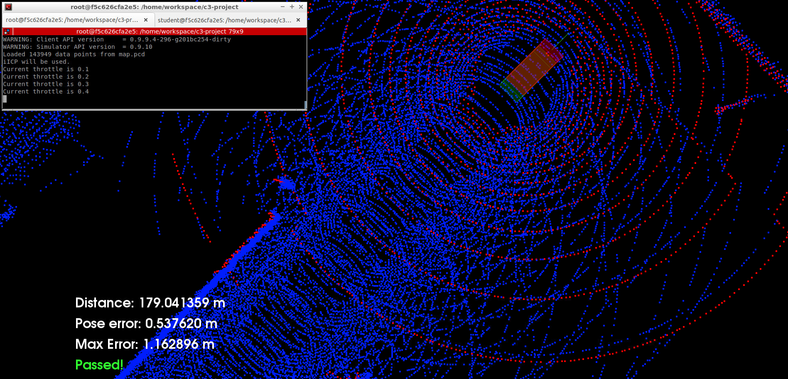
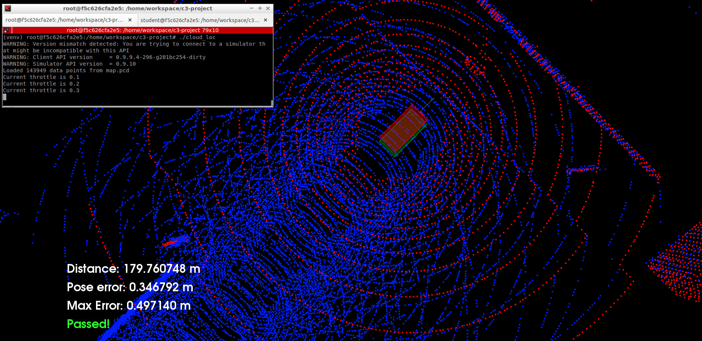

# Udacity SDCND: Scan Matching Localization

## Overview
The goal is localize a car driving in simulation for at least 170m from the starting position and never exceeding a distance pose error of 1.2m.

## Result
Both ICP and NDT algorithms are implemented.

### ICP result

### NDT result

